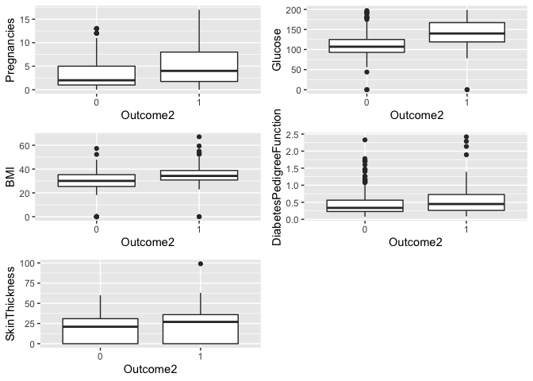

## In this Particular analysis we will try to find out relations between different variables given in the data set and we will try to fit a model to predict the diabetes outcome.

### Reading the Data and Performing some Exploratory Analysis
Data is already clean and does not recquire some specific cleaning but we will just convert the Outcome Variable to a factor variable to perform some plots.


```r
data <- "/Users/aashaysharma/Desktop/RStudio/diabetes/diabetes.csv"
diabetes <- read.csv(data)

head(diabetes)
```

```
##   Pregnancies Glucose BloodPressure SkinThickness Insulin  BMI
## 1           6     148            72            35       0 33.6
## 2           1      85            66            29       0 26.6
## 3           8     183            64             0       0 23.3
## 4           1      89            66            23      94 28.1
## 5           0     137            40            35     168 43.1
## 6           5     116            74             0       0 25.6
##   DiabetesPedigreeFunction Age Outcome
## 1                    0.627  50       1
## 2                    0.351  31       0
## 3                    0.672  32       1
## 4                    0.167  21       0
## 5                    2.288  33       1
## 6                    0.201  30       0
```

Now we have many variables but our outcome is discrete that is it is binary data 1 or 0.

#### Now I will perform aov analysis to get the variance distribution of the data so we can see that what variables account for what amount of variance.


```r
variance_analysis <- aov(Outcome ~ . , data = diabetes)
summary(variance_analysis)
```

```
##                           Df Sum Sq Mean Sq F value   Pr(>F)    
## Pregnancies                1   8.59    8.59  53.638 6.16e-13 ***
## Glucose                    1  34.02   34.02 212.406  < 2e-16 ***
## BloodPressure              1   0.12    0.12   0.771 0.380213    
## SkinThickness              1   0.86    0.86   5.393 0.020481 *  
## Insulin                    1   0.26    0.26   1.594 0.207108    
## BMI                        1   6.78    6.78  42.331 1.40e-10 ***
## DiabetesPedigreeFunction   1   1.82    1.82  11.349 0.000793 ***
## Age                        1   0.46    0.46   2.865 0.090922 .  
## Residuals                759 121.57    0.16                     
## ---
## Signif. codes:  0 '***' 0.001 '**' 0.01 '*' 0.05 '.' 0.1 ' ' 1
```

Now we can see that the variables which account for **high variance** and **lowest p-Values** are :
- Pregnancies
- Glucose
- BMI
- DiabetesPedigreeFunction
- and SkinThickness but it accounts for a bit higher p-Value compared to others in this list.

Converting the outcome to factor variable :

```r
diabetes$Outcome2 <- as.factor(diabetes$Outcome)
```

## Some Exploratory analysis :


```r
a <-ggplot(data = diabetes, aes(x = Outcome2, y = Pregnancies)) + geom_boxplot()
b <-ggplot(data = diabetes, aes(x = Outcome2, y = Glucose)) + geom_boxplot()
c <-ggplot(data = diabetes, aes(x = Outcome2, y = BMI)) + geom_boxplot()
d <-ggplot(data = diabetes, aes(x = Outcome2, y = DiabetesPedigreeFunction)) + geom_boxplot()
e <-ggplot(data = diabetes, aes(x = Outcome2, y = SkinThickness)) + geom_boxplot()
```


```r
grid.arrange(a, b, c, d, e, nrow = 3, ncol = 2)
```

<!-- -->

## Inference from the GRAPHS

Okay so after looking at the graphs we can infer that Pregnancies and Glucose have a significant mean difference with least outliers, BMI and PedigreeFunction have a lesser mean difference but have many outliers which can account for lesser accurate fit and the last graph SkinThickness has a lesser mean difference but one outlier.

##### So we can fit 3 Different models :
- Pregnancies and Glucose as features 
- BMI and PedigreeFunction as feature along with the first 2
- and all the feautres including SkinThickness.

We will use caret package for fitting and plotting.


### Models :
First we will separate the data into a training and testing set.


```r
set.seed(1234)
inTrain <- createDataPartition(y = diabetes$Outcome2, list = FALSE, p = 0.65)
train <- diabetes[inTrain,]
test <- diabetes[-inTrain,]
```

#### Model 1 ( Features : Pregnancies + Glucose)

##### Random Forest :

```r
RF_model <- train(Outcome2 ~ Pregnancies + Glucose, method = "rf", data = train, ntree = 100)
```

```
## note: only 1 unique complexity parameters in default grid. Truncating the grid to 1 .
```

```r
RF_predict <- predict(RF_model, test)
confusionMatrix(test$Outcome2, RF_predict)
```

```
## Confusion Matrix and Statistics
## 
##           Reference
## Prediction   0   1
##          0 139  36
##          1  36  57
##                                          
##                Accuracy : 0.7313         
##                  95% CI : (0.674, 0.7835)
##     No Information Rate : 0.653          
##     P-Value [Acc > NIR] : 0.003716       
##                                          
##                   Kappa : 0.4072         
##                                          
##  Mcnemar's Test P-Value : 1.000000       
##                                          
##             Sensitivity : 0.7943         
##             Specificity : 0.6129         
##          Pos Pred Value : 0.7943         
##          Neg Pred Value : 0.6129         
##              Prevalence : 0.6530         
##          Detection Rate : 0.5187         
##    Detection Prevalence : 0.6530         
##       Balanced Accuracy : 0.7036         
##                                          
##        'Positive' Class : 0              
## 
```

##### Logistic Regression:

```r
LR_model <- train(Outcome2 ~ Pregnancies + Glucose, method = "glm", family = "binomial", data = train)
LR_predict <- predict(LR_model, test)
confusionMatrix(test$Outcome2, LR_predict)
```

```
## Confusion Matrix and Statistics
## 
##           Reference
## Prediction   0   1
##          0 155  20
##          1  40  53
##                                           
##                Accuracy : 0.7761          
##                  95% CI : (0.7214, 0.8246)
##     No Information Rate : 0.7276          
##     P-Value [Acc > NIR] : 0.04112         
##                                           
##                   Kappa : 0.4798          
##                                           
##  Mcnemar's Test P-Value : 0.01417         
##                                           
##             Sensitivity : 0.7949          
##             Specificity : 0.7260          
##          Pos Pred Value : 0.8857          
##          Neg Pred Value : 0.5699          
##              Prevalence : 0.7276          
##          Detection Rate : 0.5784          
##    Detection Prevalence : 0.6530          
##       Balanced Accuracy : 0.7604          
##                                           
##        'Positive' Class : 0               
## 
```


#### Model 2 ( Features : Pregnancies + Glucose + BMI + DiabetesPedigreeFunction)

##### Random Forest :

```r
RF_model2 <- train(Outcome2 ~ Pregnancies + Glucose + BMI + DiabetesPedigreeFunction, method = "rf", data = train, ntree = 100)
RF_predict2 <- predict(RF_model2, test)
confusionMatrix(test$Outcome2, RF_predict2)
```

```
## Confusion Matrix and Statistics
## 
##           Reference
## Prediction   0   1
##          0 150  25
##          1  32  61
##                                           
##                Accuracy : 0.7873          
##                  95% CI : (0.7334, 0.8347)
##     No Information Rate : 0.6791          
##     P-Value [Acc > NIR] : 5.73e-05        
##                                           
##                   Kappa : 0.5223          
##                                           
##  Mcnemar's Test P-Value : 0.4268          
##                                           
##             Sensitivity : 0.8242          
##             Specificity : 0.7093          
##          Pos Pred Value : 0.8571          
##          Neg Pred Value : 0.6559          
##              Prevalence : 0.6791          
##          Detection Rate : 0.5597          
##    Detection Prevalence : 0.6530          
##       Balanced Accuracy : 0.7667          
##                                           
##        'Positive' Class : 0               
## 
```

##### Logistic Regression:

```r
LR_model2 <- train(Outcome2 ~ Pregnancies + Glucose + BMI + DiabetesPedigreeFunction, method = "glm", family = "binomial", data = train)
LR_predict2 <- predict(LR_model2, test)
confusionMatrix(test$Outcome2, LR_predict2)
```

```
## Confusion Matrix and Statistics
## 
##           Reference
## Prediction   0   1
##          0 154  21
##          1  37  56
##                                           
##                Accuracy : 0.7836          
##                  95% CI : (0.7294, 0.8314)
##     No Information Rate : 0.7127          
##     P-Value [Acc > NIR] : 0.005295        
##                                           
##                   Kappa : 0.5024          
##                                           
##  Mcnemar's Test P-Value : 0.048885        
##                                           
##             Sensitivity : 0.8063          
##             Specificity : 0.7273          
##          Pos Pred Value : 0.8800          
##          Neg Pred Value : 0.6022          
##              Prevalence : 0.7127          
##          Detection Rate : 0.5746          
##    Detection Prevalence : 0.6530          
##       Balanced Accuracy : 0.7668          
##                                           
##        'Positive' Class : 0               
## 
```


#### Model 3 ( Features : Pregnancies + Glucose + BMI + DiabetesPedigreeFunction + SkinThickness)

##### Random Forest :

```r
RF_model3 <- train(Outcome2 ~ Pregnancies + Glucose + BMI + DiabetesPedigreeFunction + SkinThickness, method = "rf", data = train, ntree = 100)
RF_predict3 <- predict(RF_model3, test)
confusionMatrix(test$Outcome2, RF_predict3)
```

```
## Confusion Matrix and Statistics
## 
##           Reference
## Prediction   0   1
##          0 149  26
##          1  36  57
##                                           
##                Accuracy : 0.7687          
##                  95% CI : (0.7135, 0.8178)
##     No Information Rate : 0.6903          
##     P-Value [Acc > NIR] : 0.002792        
##                                           
##                   Kappa : 0.4763          
##                                           
##  Mcnemar's Test P-Value : 0.253038        
##                                           
##             Sensitivity : 0.8054          
##             Specificity : 0.6867          
##          Pos Pred Value : 0.8514          
##          Neg Pred Value : 0.6129          
##              Prevalence : 0.6903          
##          Detection Rate : 0.5560          
##    Detection Prevalence : 0.6530          
##       Balanced Accuracy : 0.7461          
##                                           
##        'Positive' Class : 0               
## 
```

##### Logistic Regression:

```r
LR_model3 <- train(Outcome2 ~ Pregnancies + Glucose + BMI + DiabetesPedigreeFunction + SkinThickness, method = "glm", family = "binomial", data = train)
LR_predict3 <- predict(LR_model3, test)
confusionMatrix(test$Outcome2, LR_predict3)
```

```
## Confusion Matrix and Statistics
## 
##           Reference
## Prediction   0   1
##          0 155  20
##          1  37  56
##                                           
##                Accuracy : 0.7873          
##                  95% CI : (0.7334, 0.8347)
##     No Information Rate : 0.7164          
##     P-Value [Acc > NIR] : 0.00512         
##                                           
##                   Kappa : 0.5097          
##                                           
##  Mcnemar's Test P-Value : 0.03407         
##                                           
##             Sensitivity : 0.8073          
##             Specificity : 0.7368          
##          Pos Pred Value : 0.8857          
##          Neg Pred Value : 0.6022          
##              Prevalence : 0.7164          
##          Detection Rate : 0.5784          
##    Detection Prevalence : 0.6530          
##       Balanced Accuracy : 0.7721          
##                                           
##        'Positive' Class : 0               
## 
```


### Printing the model Accuracies :

1 -> Pregnancies
2 -> Glucose
3 -> BMI
4 -> DiabetesPedigreeFunction
5 -> SkinThickness

#### Random Forest 

```r
print("RF Model 1 + 2")
```

```
## [1] "RF Model 1 + 2"
```

```r
confusionMatrix(test$Outcome2, RF_predict)$overall[1]
```

```
##  Accuracy 
## 0.7313433
```

```r
print("RF Model 1 + 2 + 3 + 4")
```

```
## [1] "RF Model 1 + 2 + 3 + 4"
```

```r
confusionMatrix(test$Outcome2, RF_predict2)$overall[1]
```

```
##  Accuracy 
## 0.7873134
```

```r
print("RF Model 1 + 2 + 3 + 4 + 5")
```

```
## [1] "RF Model 1 + 2 + 3 + 4 + 5"
```

```r
confusionMatrix(test$Outcome2, RF_predict3)$overall[1]
```

```
##  Accuracy 
## 0.7686567
```

##### Logistic Regression

```r
print("LR Model 1 + 2")
```

```
## [1] "LR Model 1 + 2"
```

```r
confusionMatrix(test$Outcome2, LR_predict)$overall[1]
```

```
##  Accuracy 
## 0.7761194
```

```r
print("LR Model 1 + 2 + 3 + 4")
```

```
## [1] "LR Model 1 + 2 + 3 + 4"
```

```r
confusionMatrix(test$Outcome2, LR_predict2)$overall[1]
```

```
##  Accuracy 
## 0.7835821
```

```r
print("LR Model 1 + 2 + 3 + 4 + 5")
```

```
## [1] "LR Model 1 + 2 + 3 + 4 + 5"
```

```r
confusionMatrix(test$Outcome2, LR_predict3)$overall[1]
```

```
##  Accuracy 
## 0.7873134
```

### Final Conclusion

We can see the accuracies and they are a bit close, but there are some outliers in BMI and PedigreeFunction Variables thus the fit can be faulty in some manner but over all we can see all this 5 variables have some significant effect over diabetes outcome.

Further we can try more combinations and other models to see what fits the best, we cannot just rely on accuracies 


