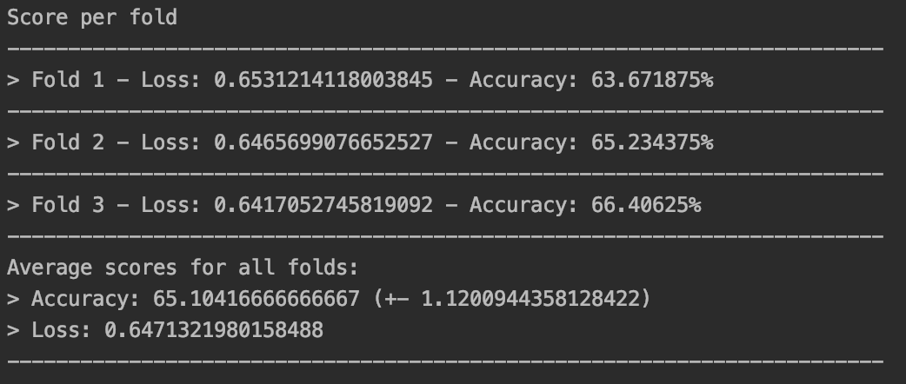

# Diabetes-Outcome-Prediction
Analysis and Prediction of Diabetes Outcome with machine learning and deep learning approach 

## Objective 
To correclty (or atleast some times) predict diabetes outcome for a person or a patient given some of their medical attributes which is listed in selected in the report (included in this repo as .md file). The data set used in this analysis was already a clean data set with the recquired schema and thus need no or minimal data tidying or cleaning, the report consists of the statistical methods used to select different features from the complete data set. 

## The Machine Learning Approach 
After some exploratory analysis with the selected attributes from the dataset, I applied some common ML algoritms (widely used for classification problems), though the models perform well and can be used for inference and base level predictions but a deep learning approach is neccesary as it can help us infere more about the data and give much better predicitions (more real world predictions)

## The Deep Learning Approach 
The dataset which is used in this problem contains only 768 instances (ie, rows or records), so it is sufficient for a machine learning problem but is very small for a deep learning problems as the data will be splitted further into test and train sets and for correct evalutation of the model we would be left with a very small test set which wont give us good or highly significant metrics for our model. So eradicate this problem to a acceptable level we can use K Folds Cross validation method to train and evalusate our model so that even with such a small data we can get pretty good and most important "significant" metrics for our model.

The choice of model is also very simple due to data limitation and so we will use a model with only 2 layers, the model schema is summarized below:  

   INPUT LAYER    : 8 UNITS SHAPE(5,), ACTIVATION = "RELU"  
#1 HIDDEN LAYER 1 : 8 UNITS, ACTIVATION = "RELU" 
#2 OUTPUT LAYER 2 : 1 UNIT , ACTIVATION = "SIGMOID" (FOR BINARY CLASSIFICATION PROBLEM) 

LOSS FUNCTION : BINARY_CROSSENTROPY  
OPTIMIZER     : STOCHASTIC GRADIENT DESCENT (SGD)  
METRICS       : ACCURACY (HOW MANY LABELS DID WE CORRECTLY PREDICT FROM TEST SET) 

VALIDATION METHOD : K FOLDS CROSS VALIDATION WITH 3 FOLDS 
NOTE : Also tweaked and tried 10 folds as well as 5 folds but the final metrics did not have any significant or drastics changes so chose 3 Folds 

## Results:

<!-- -->

